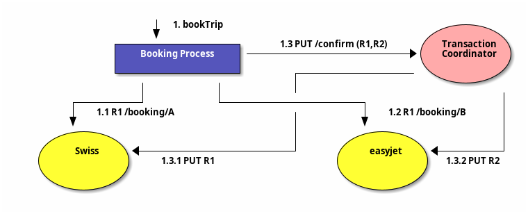

```plantuml

@startditaa

                    |1. bookTrip                          +------------+
                    v                                     |            |
              +-----------------+ 1.3 PUT /confirm (R1,R2)| Transaction|
              | Booking Process |------------------------>| Coordinator|
              |           cBLU  |                         |            |
              +-----------------+       +-----------------|    cPNK {o}|
                  |          |          |                 +------------+
                  |          |          |                             |
        +---------+          +--------------------+                   |
        |1.1 R1=/booking/A              |         |1.2 R1=/booking/B  |
        v                               |         v                   |
   +------------+                       |     +------------+          |
   |            |                       |     |            |          |
   |    Swiss   |<----------------------+     |   easyjet  |<---------+
   |            |  1.3.1 PUT R1               |            |1.3.2 PUT R2
   |            |                             |            |
   |    cYEL {o}|                             |    cYEL {o}|
   +------------+                             +------------+


@endditaa

@startditaa
                   
                    |1. use tcc
                    |                                                        +------------+
                    v                       (TccLink1,TccLink2)              |            |
              +-----------------------+ 1.3 POST /tcc/api/v1/tcc/            | TCC        |
              | Use TCC               |------------------------------------->| SERVER     |
              |                   cBLU|                                      |            |
              +-----------------------+  +-----------------------------------|    cPNK {o}|
                  |          |           |                                   +------------+
                  |          |           |    1.2 TccLink2=/microservice/B    |3. TCC WS @MessageMapping("/tccLink/{path}")
        +---------+          +-------------------------+                      |  ^       ^ 
        |1.1 TccLink1=/microservice/A    |             |                      |  |       |
        |POST                            |             |POST                  |  |       |
        v                                |             v                      |3.2 Websocket /topic/tccLink/B<-(ALL confirm OK)
   +--------------+                      |         +--------------+           |  |       |
   |              |                      |         |              |           |  |       |
   | Microservice |<---------------------+         | Microservice |<----------+  |       |
   | A            |2.1 PUT /microservice/A/confirm | B            |2.2 PUT /microservice/B/confirm
   |              |                                |              |              |       |
   |              |                                |              |<-------------+       |
   |      cYEL {o}|                                |      cYEL {o}|2.2.1 Websocket (B confirm OK)->/app/tccLink/B
   +--------------+                                +--------------+                      |
        ^4.1 ALL OK then transaction commit        4.2 ALL OK then transaction commit    |  
        |                                                                                |
        |2.1.1 Websocket (A confirm OK)->/app/tccLink/A                                  |
        +--------------------------------------------------------------------------------+
                                          3.1 Websocket /topic/tccLink/A<-(ALL confirm OK)

@endditaa


```
