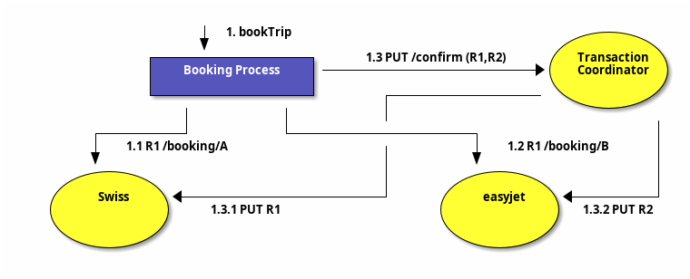

```plantuml

@startditaa

                    |1. bookTrip                          +------------+
                    v                                     |            |
              +-----------------+ 1.3 PUT /confirm (R1,R2)| Transaction|
              | Booking Process |------------------------>| Coordinator|
              |           cBLU  |                         |            |
              +-----------------+       +-----------------|    cYEL {o}|
                  |          |          |                 +------------+
                  |          |          |                             |
        +---------+          +--------------------+                   |
        |1.1 R1=/booking/A              |         |1.2 R1=/booking/B  |
        v                               |         v                   |
   +------------+                       |     +------------+          |
   |            |                       |     |            |          |
   |    Swiss   |<----------------------+     |   easyjet  |<---------+
   |            |  1.3.1 PUT R1               |            |1.3.2 PUT R2
   |            |                             |            |
   |    cYEL {o}|                             |    cYEL {o}|
   +------------+                             +------------+


@endditaa


```
