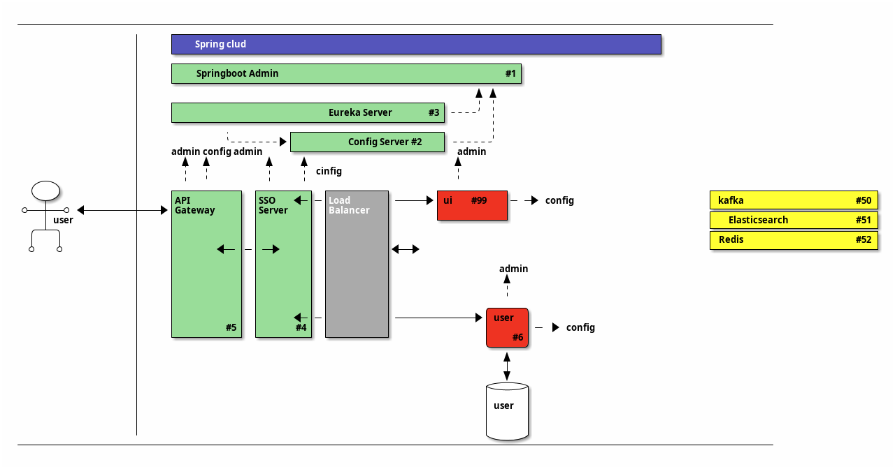

```plantuml

@startditaa
-------------------------------------------------------------------------------------------------------------


                 |    +---------------------------------------------------------------------+
                 |    | Spring clud  cBLU                                                   |
                 |    +---------------------------------------------------------------------+
                 |    +-------------------------------------------------+
                 |    | Springboot Admin      cGRE                    #1|
                 |    +-------------------------------------------------+
                 |                                                ^ ^
                 |    +--------------------------------------+    : |
                 |    |   cGRE             Eureka Server   #3|----/ |        
                 |    +--------------------------------------+      :
                 |            :        +---------------------+      |
                 |            \------->|cGRE Config Server #2|------/
                 |  admin config admin +---------------------+ admin
                 |      ^  ^        ^    ^                     ^
                 |      :  :        :    :cinfig               |
  +---+          |      |  |        |    |                     :
  |{o}|          |    +---------+ +-------+ +--------+      +---------+                            +-----------------------+
  +-+-+          |    |API      | |SSO  <-|-|Load    |----->|ui  #99  |-:->config                  |kafka cYEL          #50|
 *--+--* <-------+--->|Gateway  | |Server | |Balancer|      |cRED     |                            +-----------------------+
    |user        |    |         | |       | |        |      +---------+                            |Elasticsearch cYEL  #51|
  /-+-\          |    |cGRE     | |cGRE   | |        |                                             +-----------------------+
  |   |          |    |         | |       | |cAAA    |                                             |Redis cYEL          #52|
  *   *          |    |      <--|-|-->    | |        +<-->                                         +-----------------------+
                 |    |         | |       | |        |                                            
                 |    |         | |       | |        |               admin
                 |    |         | |       | |        |                ^
                 |    |         | |       | |        |                :
                 |    |         | |       | |        |                |
                 |    |         | |       | |        |             /-----\
                 |    |         | |     <-|-|        |------------>|user |
                 |    |       #5| |     #4| |        |             |cRED |--:>config
                 |    +---------+ +-------+ +--------+             |   #6|
                 |                                                 \--+--/
                 |                                                    ^
                 |                                                    |
                 |                                                    v
                 |                                                 /-----\
                 |                                                 |     +
                 |                                                 |user |
                 |                                                 |     |
                 |                                                 |  {s}|
                 |                                                 \--+--/

-------------------------------------------------------------------------------------------------------------
@endditaa

```
