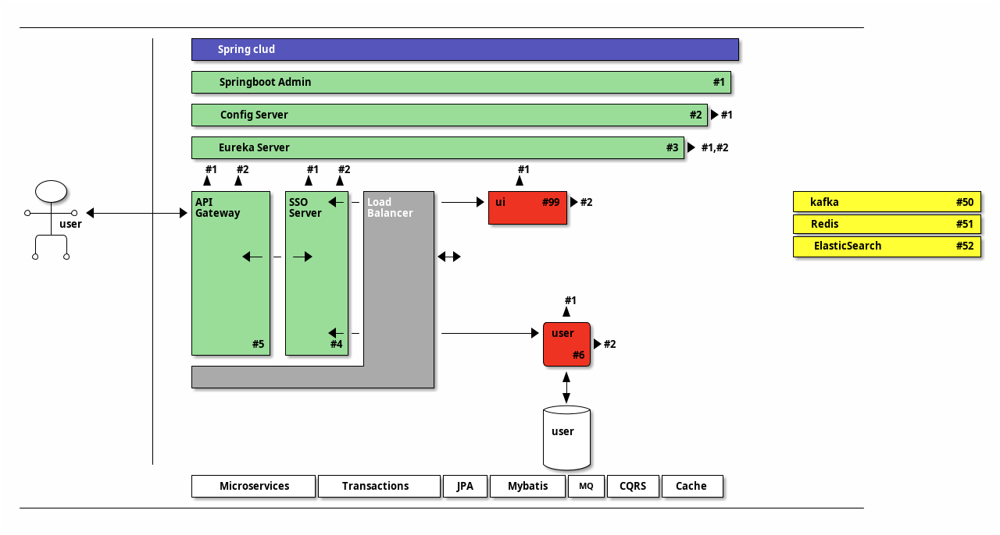

```plantuml

@startditaa
-------------------------------------------------------------------------------------------------------------


                 |    +---------------------------------------------------------------------+
                 |    | Spring clud cBLU                                                    |
                 |    +---------------------------------------------------------------------+
                 |    +--------------------------------------------------------------------+
                 |    | Springboot Admin cGRE                                            #1|
                 |    +--------------------------------------------------------------------+
                 |    +-----------------------------------------------------------------+
                 |    | Config Server cGRE                                            #2|>#1
                 |    +-----------------------------------------------------------------+
                 |    +--------------------------------------------------------------+
                 |    | Eureka Server cGRE                                         #3|>#1,#2
                 |    +--------------------------------------------------------------+
                 |      #1  #2       #1  #2                     #1
  +---+          |      ^   ^        ^   ^                      ^
  |{o}|          |    +---------+ +-------+ +--------+      +---------+                            +-----------------------+
  +-+-+          |    |API      | |SSO  <-|-|Load    |----->|ui    #99|>#2                         | kafka cYEL         #50|
 *--+--* <-------+--->|Gateway  | |Server | |Balancer|      |cRED     |                            +-----------------------+
    |user        |    |         | |       | |        |      +---------+                            | Redis cYEL         #51|
  /-+-\          |    |cGRE     | |cGRE   | |        |                                             +-----------------------+
  |   |          |    |         | |       | |cAAA    |                                             |ElasticSearch cYEL  #52|
  *   *          |    |      <--|-|-->    | |        +<->                                          +-----------------------+
                 |    |         | |       | |        |
                 |    |         | |       | |        |
                 |    |         | |       | |        |
                 |    |         | |       | |        |                #1
                 |    |         | |       | |        |                ^
                 |    |         | |       | |        |             /-----\
                 |    |         | |     <-|-|        |------------>|user |
                 |    |       #5| |     #4| |        |             |cRED |>#2
                 |    +---------+ +-------+ |        |             |   #6|
                 |    +---------------------+        |             \--+--/
                 |    |                              |                ^
                 |    +------------------------------+                |
                 |                                                    v
                 |                                                 /-----\
                 |                                                 |     +
                 |                                                 |user |
                 |                                                 |     |
                 |                                                 |  {s}|
                 |                                                 \--+--/

                      +---------------+---------------+-----+---------+----+------+-------+
                      | Microservices | Transactions  | JPA | Mybatis | MQ | CQRS | Cache |
                      +---------------+---------------+-----+---------+----+------+-------+

-------------------------------------------------------------------------------------------------------------
@endditaa

```
